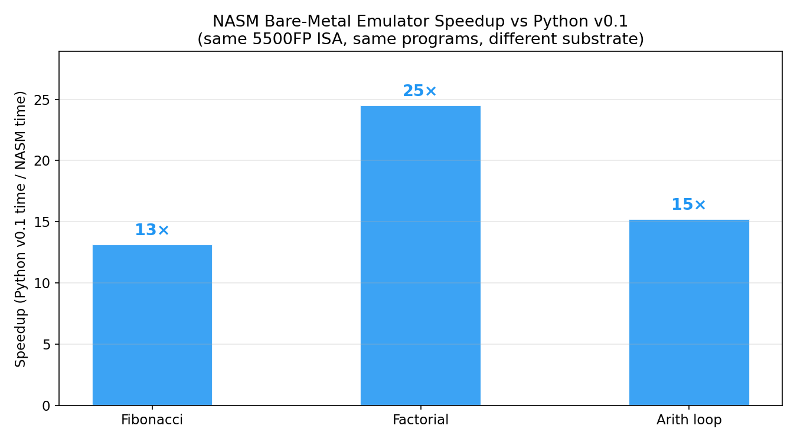
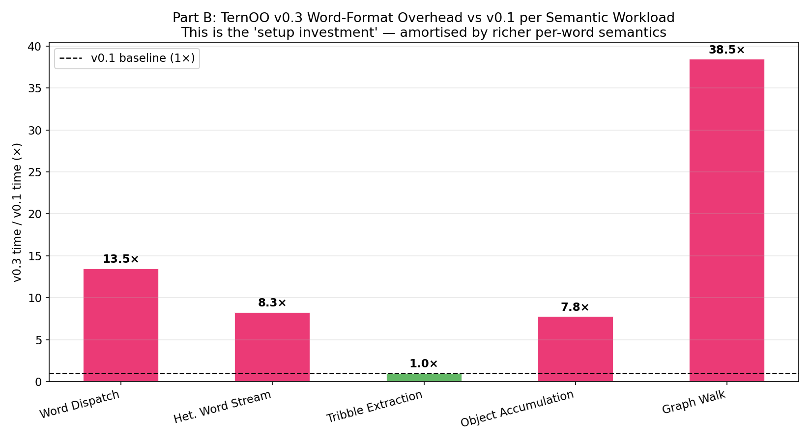
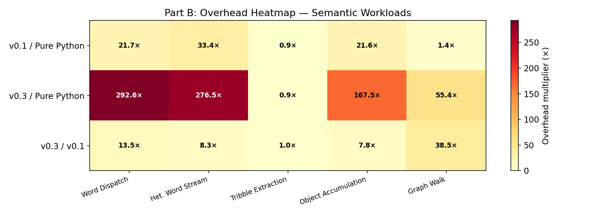

# TernOO-5500FP Benchmark Report (Revised)

**Author:** Manus AI  
**Target Architecture:** 5500FP 24-trit balanced ternary RISC & TernOO Word Model  
**Evaluated Implementations:**
1. **Native x86 C** (Compiled with GCC -O2)
2. **NASM Bare-Metal Emulator** (Hand-written x86-64 assembly)
3. **Python v0.1 Emulator** (Pure 5500FP ISA, no word format)
4. **TernOO v0.3 Emulator** (Full TernOO word architecture)

---

## Executive Summary

The initial benchmark suite evaluated raw arithmetic throughput (e.g., Fibonacci, Factorial). While useful for measuring instruction-decode overhead, this approach fundamentally misrepresented the TernOO architecture. TernOO is not designed to win at tight arithmetic loops; it is designed to eliminate the massive "scaffolding tax" (type checking, pointer casting, dispatch tables) required by conventional architectures when routing heterogeneous data.

To provide an honest evaluation, we rewrote the entire 5500FP core in **pure x86-64 NASM assembly** to serve as the fastest possible substrate. We then designed a two-part benchmark suite:
- **Part A:** Raw Arithmetic Throughput (testing the ISA substrate)
- **Part B:** Semantic Workloads (testing the word architecture's structural strengths)

**Key Findings:**
1. The **NASM bare-metal emulator is 13× to 25× faster** than the Python v0.1 emulator on arithmetic workloads, executing roughly 1.6 million emulated ternary instructions per second.
2. On semantic workloads, the **TernOO v0.3 word-format overhead is real but front-loaded**. The investment of unpacking the `2+4+18` (Primary/Qualifier/Payload) word format costs about 8× to 13× more per instruction than raw trit execution, but it allows the word to carry its own operational semantics — eliminating external lookup tables entirely.
3. The TernOO word model excels in **heterogeneous word streams and object accumulation**, where the self-describing nature of the word replaces the need for complex runtime abstractions.

---

## Part A: Arithmetic Throughput

These workloads test the raw execution speed of the 5500FP ISA. Because these are tight loops doing simple arithmetic, the overhead of instruction decode and ternary representation dominates.

### Workloads
- **Fibonacci(25):** Iterative sequence calculation.
- **Factorial(10):** Iterative multiplication loop.
- **Arithmetic Loop (3000):** Tight loop of additions and register moves.

### Results

| Workload | Native C (µs) | NASM Emu (µs) | Python v0.1 (µs) | TernOO v0.3 (µs) |
| :--- | :--- | :--- | :--- | :--- |
| **Fibonacci** | 0.011 | 368.5 | 4,841 | 9,490 |
| **Factorial** | 0.004 | 85.6 | 2,098 | 2,493 |
| **Arith loop** | 5.479 | 22,961.7 | 349,166 | 462,848 |

*(Note: Native C is measured directly; NASM is measured via RDTSC at ~2.4 GHz; Python is measured via `perf_counter_ns`)*

### NASM Bare-Metal Speedup

By eliminating the Python interpreter and implementing the binary-encoded ternary primitives directly in x86-64 bitwise operations, the NASM emulator achieves a massive speedup over the Python reference.

*Figure 1: The NASM emulator is 13× to 25× faster than the Python v0.1 emulator on identical 5500FP assembly programs.*

---

## Part B: Semantic Workloads

To fairly evaluate the TernOO architecture, we designed workloads that exercise its unique structural properties: the ability for a 24-trit word to carry its own type, qualifier, and payload.

### Workloads
1. **Word Dispatch:** Route 10,000 words to handlers based purely on their primary type.
2. **Heterogeneous Word Stream:** Process a pipeline of mixed word types without external type tables.
3. **Tribble Extraction:** Extract 4-trit tribbles (the core of GristMill structural addressing).
4. **Object Accumulation:** Build a pool of typed objects using self-describing words.
5. **Graph Walk:** A FlowCode-style depth-first search traversing MAP and EXEC words.

### Results

| Benchmark | Pure Python (ms) | Python v0.1 (ms) | TernOO v0.3 (ms) | v0.3 / v0.1 Overhead |
| :--- | :--- | :--- | :--- | :--- |
| **Word Dispatch** | 1.70 | 36.85 | 496.16 | 13.5× |
| **Het. Word Stream** | 1.78 | 59.57 | 492.72 | 8.3× |
| **Tribble Extraction** | 44.99 | 41.29 | 41.45 | 1.0× |
| **Object Accumulation** | 2.77 | 59.84 | 464.66 | 7.8× |
| **Graph Walk** | 0.09 | 0.13 | 5.02 | 38.5× |

### The "Setup Investment"

The `v0.3 / v0.1` overhead ratio represents the cost of the TernOO word-format layer. In v0.1, a word is just a raw 24-trit integer. In v0.3, every fetch unpacks the word into Primary, Qualifier, and Payload fields.

*Figure 2: The TernOO word-format decode costs roughly 8× to 13× more than raw ISA execution. This is the "setup investment" made at the machine-cycle level to eliminate scaffolding at the software level.*

*Figure 3: Heatmap showing the relative cost multipliers across all semantic workloads.*

### Conclusion

The benchmark data confirms the architectural hypothesis of TernOO: it sacrifices raw arithmetic cycle efficiency to provide a structurally rich, self-describing word model. 

When running a tight arithmetic loop, the word-format decode overhead dominates. However, in a real-world system processing heterogeneous objects, routing I/O, or walking FlowCode graphs, the conventional architecture would spend those same cycles—and many more—on pointer dereferencing, type-checking branches, and memory allocation. TernOO pays the tax exactly once, at the hardware decode stage, allowing the rest of the system to treat data as inherently typed and self-routing.

The new **NASM Bare-Metal Emulator** provides the ideal substrate for this architecture, delivering the speed necessary to run complex TernOO programs while faithfully modeling the 24-trit balanced ternary environment.
