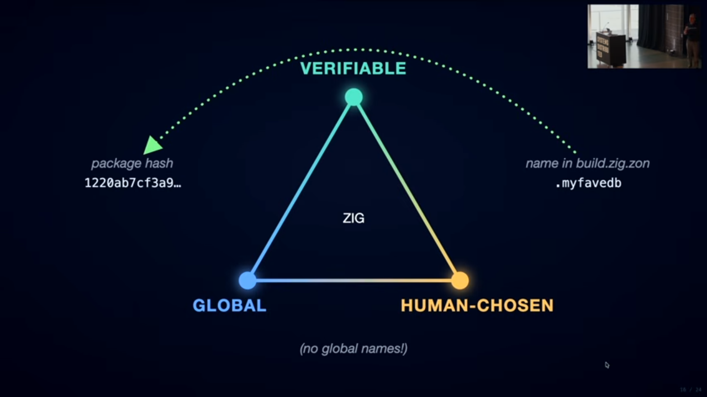

23:20 02/10/2026 ACST

To: crew
From: Stevo (via web face)
Subject: Zooko's Talk With the Graphic.

       

# THE ZOOKO TALK 

       

Ah, thanks. Thanks for being here. Um,

the other day I said to my girlfriend, "When I was a kid, all I wanted to do was play with my computer all the time,

and now I get to do that." And then uh I was introducing H

yesterday and I looked at this uh research project that H did where he

interviewed a bunch of engineers from like mechanical and electrical and spacecraft and whatever. And one comment

he was asking them what it was like how that was different from software engineering from the other kind of engineering they did. And one common

comment that struck me was they only get to go to academic conferences and vendor

trade shows. And I've been to a lot of those and and this uh people who get

together just for the love of the craft is much better. So, thank you all for

being part of this. Um I'm not going to talk about Zcash, but

it's my favorite thing ever. So, check out Zcash. If you if you think unstoppable private money is

interesting, then check out Zcash. Uh this is about this Zukos triangle.

was actually um I actually came here with a different talk and then after Andrew Kelly's talk last morning about

Zigg and the Zig package manager then I threw that out and wrote this talk. Uh so this is the first time I've ever done

this. It Zuko's triangle was a idea I came up with and wrote a blog post in

2001 quarter century ago and this is the first time I've ever updated it. Um

it said let's think about properties of names. And by names I actually mean something

very general like identifiers like uh a pointer identifies

an area of memory. Um a DNS name identifies something in the DNS system.

Uh maybe a a variable name binding in your programming language. That's a name. Um, an IPv4 address is is like

identifies something. Um, there's a lot of different things. And I said in general, back in 2001, I said in

general, you can either have security, human readability, or decentralization in your

name, but you can't have all three at once. You can only have any two at a time. And so that was a big deal. People

thought this was a very interesting proposal. But then almost as soon as it became popular and got its own Wikipedia

page and so forth, then I tried to use it and explain it better to people

and I realized I don't know what I meant by secure.

It could mean [sighs and gasps] like my best guess was it means nobody else can seize control of it from you.

I don't know. Security is underspecified. Security means different things to different people, right?

And then um I realized I don't know what I mean by decentralized, right? Decentralized means different things to

different people. Um and then finally I realized do I is human readable what I

want or what I what I'm interested in, what people are interested in. Do they need to be able to memorize a name so

they can type it in later like it's a password or what? So I didn't know what

that meant either. So, for about 25 years, I've been pretty confused about this. And um along the way,

I had this idea we could look at the edges instead of the points. Okay? Because there's examples that exist and

that people use on the edges. So, the first one is DNS plus TLS plus PKI.

However, those things fit together somehow or other. But look, I changed decentralized

into global meaning when you give someone your DNS name like fu.com

no one ever says like which DNS is this the foo.com in right whereas if you give them your your your handle like my

handle is zuko they might say is that in Facebook or in Twitter or in Weimbo or

whatever it's called um so global that seems pretty clear it's like contextf

free right like I don't know I might still not understand this This is I hope

you're going to ask questions at the end cuz uh I have a question for you on the last slide which is what do we really

mean by global? Anyway, DNS seems like it's global, right? And you get to

choose your own DNS name when you register it. So, it's human chosen.

Uh and what my thesis is you have to give up something to get these. What do we give up?

Where we go? There we go. I'm thinking maybe instead of calling it secure,

I'm going to call it verifiable because when you put a DNS name into your web browser or your local user agent, SSH

agent or anything, your local agent is not really going to

give you any guarantee about what happens, right? Like if you load if you

load Facebook.com in Russia, it's going to give you a different answer than if you load Facebook.com in America, right?

And if you load um the RAMP for you malware site, it's going to you're going

to load the FBI, right? Like if you load ramp for you, it's it was a malware site. Uh if you load that DNS name, it

says, "Oh, my new name servers are seized servers.fbi.gov." And there's like a splash page uh

trolling the former users of that site. But the point is I don't think I don't think

with DNS and TLS and PKI I I can get any specific

guarantee or verification of what I saw. I think I don't know. We'll see. Let's

look at the next edge as we circle Zuko's triangle. Verifiable and global.

In 2001, there weren't very many of these. Um but now it's kind of taken over the world, right? We use all this

all the time. Get secure hashes came out in 2005. Um,

Docker images, you use the secure hash of the Docker image to know which one you're loading. Uh, Zigg

has secure hashes in the build.zig.zon file next to the local name, right? Um,

when you SSH to something, well, it's interesting. You don't put in the secure

hack or the public key when you SSH. You put in like a DNS name or an IP address or something and then SSH tells you, oh,

this is the public key and I'll save it in your uh known host file, right?

But for onion, to onions, do you all know about to onions? It's been around a while. And what it boils down to is you

use the public key instead of an IP an IP address or anything else as the

address. So you actually, you know, you say I want to connect to where I want to connect to this public key and it's a

tour onion that you paste in there or load in there. And this new thing Iro just came out 1.0 I know like three or

four weeks ago and it's a really cool peer-to-peer networking tool with it's based on quick

and it uses multiccast and has encryption and whatever um and firewall

piercing and all kinds of useful cool neat stuff. But the thing that I really

find exciting about IRO as contrasted with um whatever quick or any other

thing is that you dial by public key. You never tell IRO, I want to connect to

a certain IP address. You tell it I want to connect to a certain public key and then it figures out everything it needs.

But that means it's it's always verifiable like you there's no way like the your client side implementation has

the cryptographic data it needs up front in the form of the public key to verify

that you're connecting to something that controls the corresponding private key.

Oh, and then Bitcoin came out in 2008, 2009, and there's a huge innovation in Bitcoin,

which is that there's no global names in it. I think for a lot of people when

they learned how Bitcoin worked and they used Bitcoin, that was the first time they started like cutting and pasting

public keys around because you remember, you don't do it very much with SSH. Maybe occasionally,

um, but in Bitcoin, there aren't any global names. So you you can't do anything but cut and paste the actual public key. So if you want to if you ask

someone, I want to send you Bitcoin, they send you their public key and then

you paste the public key into your local Bitcoin client. Anyway, so there's a lot

of examples of this and look how they're for different reasons. Immutable objects which is totally taken over the world

like everyone is doing this more and more now than ever before. public keys

for network connections, which everyone's used to from SSH, but it gets

a lot better if you use the new thing where you you uh you use the public key as the identifier instead of using the

DNS name or IP address as the identifier or the host name instead of using any of that as the identifier. That's

interesting. Maybe not better, different. Um, all of these

you don't get to choose, but that's okay. Nobody's bothered the fact you don't get to choose your get commit hash

to be pretty. Um, right? People have gotten used to the

fact that these things you don't get to choose them. The computer chooses them for you and you you use use them and

that's fine. All right. Continuing to circle Zuko's triangle.

What is verifiable and human chosen but not

global? Is there also examples on the third edge?

Yeah. Lots like your address book in your phone. You get to choose what name

you ascribe to your phone contacts. Like this is the name you choose for

them, not the name that uh they chose for themselves that they suggest to you

like the first time you connect. But but you have an an address book where you can edit it. It's totally up to you.

They don't get to control it. the computer doesn't choose it for you necessarily and it's totally local,

right? Your phone address book. Um, your SSH known hosts files pretty

much like that, right? Oh, and um I didn't put it up here, but maybe I did.

The uh the build.zig.z file has a local

name space in it where you get to choose names, put them in there. They're human readable

but they're not global names. No one no one expects them to live in any

global namespace. So I think it's quite doable and practical to have things that are or

identifiers that are uh secure in some way. They're verifiable in some way. Like nobody

uh can hack or spoof your known host file or your phone address book or your build.zigs zigods on in your in your

project, but nobody tries to make all of these agree with each other in a global

name space. So, this is why I got really excited yesterday at Andrew Kelly's talk is that I'll just skip to the zig part.

I'll go back to the signal part is that there's no global names.

Like this is

one of my favorite things that I want people to try is what Zigg has tried which is just do without

the global and human chosen edge. It's it's kind of the electric third wheel or

electric third rail. It's uh it might [clears throat] cause trouble like so see how far you can go without it. And

apparently Zigg package manager is trying that. Um, so in the zig package

manager there's a a local name in there like you can call it my fave db when you

are name identifying what other package your package depends on and that gets mapped

to a secure hash of the current version of that DB. Right? Okay let's look at signal real quick. I really like signal

and it's interesting because it has all three kinds in one app.

Uh there's the signal safety number which is not chosen and it's global

um [clears throat] and you can use it to verify that your signal connection is correct. There's

the global and human chosen semihuman chosen username. can choose a username

when you sign up for signal and then it will append a number at the end to disambiguate it from everyone else who

chose the same name and then there's the same local nickname as an address book. So,

okay, there's a neat thing that happens here, which is

your local app, your local client can pivot around the verifiable edge

to tie uh this edge and that edge to each

other. And this happens all the time. This is like a few apps have started

doing this, starting with your phone book, but there's a bunch of apps that could do this and haven't figured it out

yet. Um, when your phone or your signal rings and

it pops up and says who's calling and it says wifey's calling, wifey is your pet name for this phone number or this

signal pier. It's not a global name and it's verifiably secure. Nobody else can

cause your local app to say that. And then on the other direction, when

you make when you choose to who to call, you never choose which safety number you want to call. You choose which local

name in your local database you want to call. And this is equivalent or similar

to um what you're putting into your build.zig.zon file. you're you're choosing you're specifying using the

names that are comfortable to you, but it's going to pivot to a global name in

a global a global identifier in a global identifier space and have both. Okay,

now there's a missing piece. So, here's the

here's the um here's what I get to after circling Zuko's triangle several time many times.

There's a missing piece which is public keys as identifiers

for data not for connections.

Taho LFS is another project that I did along the way and I put it up here. No one currently uses it, but I put it up

here because it has a lot of really good docs. It was made by other people uh smarter than me, but I contributed to

it. Um it has some really good papers and documents and explanation of this

architecture. So if you're interested in this architecture, you might want to look up Taho.

And the architecture is let's use a public key as the identifier of something and compare it to the secure

hash as the identifier of something which has taken over the world. There's something else that maybe we could

extend it and use it. Um the secure hash is great as the identifier of an immutable

object. Uh it can never change. That's great. That makes things simple and secure. And um the only missing piece is

finding a copy of the object. But so this is sufficient. Using the secure hash as the identifier is sufficient for

verification. The only missing piece is where to acquire it from. And there's lots of good solutions for that. Now

you guys can jump up and interrupt me. I know we don't do that at this conference, but I'm about to talk about

the Zigg package manager, which I don't actually know how it works. So if I make a mistake, let me know so we don't waste

everyone's time. So in the zig package manager, it's got this really great um property

of uh transitive immutable verification, right? It's like a it's kind of like a

Merkel tree, but the nodes in the Merkel tree are packages that depend on other

packages instead of whatever blocks in a file system or something. Um,

and all of the links are immutable because all of the identifiers, the identifiers in this case are these ones,

the verifiable global non-human chosen ones. Right? And so there's a transitive

closure of a Merkel tree of all of those uh hashes now.

Uh wouldn't it be interesting if you could put an identifier into your

build.zig.zon on which was not this version of this package but some version

of the package that was signed by this public key. That would be the extension

from the immutable to the mutable domain of the same edge verifiable and global

but not human chosen. And there's some reasons why this is bad

idea. It won't work. I'll tell you in a second. And some reasons why it's a good idea and it might work.

But here's the idea and what I love about it is there's

still no global names. This is one of the reasons why it might work. Let me tell you about some experiments along

these lines that have failed. The biggest one was the APK package manager.

For many years, the Android packages had exactly the

pattern of using a public key as the identifier and using a trust on first use concept. So that if you had

installed an APK, then it your operating system would

require a signature from the same public key in order to update that APK, which is exactly what I'm asking for here. But

it was a huge failure. uh it was it was very large scale. There was many Android users and many Android packages. And

then what happened was every now and then the package manager would lose their private key or die or something,

right? Or the the guy who controlled the private key would quit and take the private key with him and then the

company would be left without it. And that was such a problem. workaround for many years until I think 2021 or

something was okay now you've got to somehow get in touch with all of your users and tell them to switch to a

different app because you cannot update the app they're currently using and that wasn't very satisfying and so then the

final solution the final solution was

uh in order to distribute a APK and the official Google managed stores you have

to give Google the private So, [laughter] so the so what it boils down to is

in the current state of play, Google can update all of the apps that all the

users use on all the Google Android devices. Uh but that was their solution

to the problem of the users losing their private key and it being painful to work around. So, we wouldn't want Zigg to try

that and end up there, right? But I don't think it will because because

it doesn't have global names in the first place which means the zig package

manager has to already has to work around this problem like you work around this equivalent

similar problem all the time and there's one more reason why the zig

package manager is in a really interesting place. Let me see if I can explain it. Now, I I didn't try to draw

this graphically because it's three-dimensional or it requires two screens or something. So, I'm going to

try interpretive dance instead. Ready? Um,

this is all this part over here, the local the verifiable and human chosen

part is basically local, right, to to one user or something. It's local to some scope. So, got some local scope.

And here's what's interesting about the Zig package manager. Over in uh

over in Signal, the local scope is my signal app on my phone. Okay, for my

user in the Zigg package manager, the local scope is the build.zig.zon in this

in this package and then you publish that, right? Other people's local scopes

are now available to you. Interesting, huh? 

So it's so linked

local namespaces is a very powerful idea that I don't know

if it's been explored yet like all these like the big failure with the APKs and

the Google that was all there was no linked local namespaces and there was a

global namespace that everyone could fall back on and just require everyone to give their private keys to Google and

that worked but linked local namespaces. So there's a

there's a thing that could happen in signal and doesn't

which would require this concept of linked local namespaces and it would be very useful and it would improve security for me and for a lot of people

which is what happens when I know you and I have a signal connection to you and I want to let this other person have

a signal connection to you. I want to introduce you. Introduction is a very important common part of the human

experience. And currently when I have a signal connection with

you, it's secure. So having a onetoone relationship is an important part of the human experience. And signal currently

maps this onetoone relationship to a cryptographically insured quality that nobody else can be spying or faking

messages between us. So it successfully creates basically the equivalent of like before we had phones and we could stand

face to face where no one else was around and we could have like a normal conversation. Signal implements that but

it does not implement another very normal important part of the human experience which is hey I want you to

meet you and talk to each other that's currently insecure in signal. The

only way to do it is to either refer to the global name,

which may or may not end up being the person I meant to introduce you to. There's no

way to do it. But there is a way that it could be done with linked local namespaces, which Signal currently doesn't do. I don't know why not. They

might try it. It might be complicated. And maybe the Zig built package manager

could do it with linked local namespaces. So, the way it would work in Signal would be I would send you a

message that says, "I want you to meet so- and so." And inside your Signal app, there'd be a button like accept

introduction or something. And if you clicked that button, then you

your signal app would be verifying for you that this other signal two-way

bilateral chat is the one that I meant from our from our two-way chat. Make

sense? All right. Well, I mean, more interpretive dance needed, but the the

local namespace, there are many of them. We can connect them together through the

global and secure namespace. Then I go back to calling it secure instead of verifiable because I don't

know what I mean. But verifiable secure

u and then and I don't think people are really taking advantage of this possibility yet. So

I don't know how it would work or if it would be useful in zigg but it's interesting that the contents

of package B's built zigzon which can contain a secure

hash indicating a specific version of a specific package. It could also maybe

contain a public key indicating any version that's signed by this private

key. But what I think is interesting is that that local namespace gets

replicated and it becomes available to package A. And it doesn't mean that package A has

to agree that whatever package B thinks is the best database is also what package A thinks is the best database.

But the fact that package B has that is useful information I think.

Okay, here's here's the part where you better start coming up with questions or taking notes

or something because I'm still circling Zuko's triangle 25 years later. We

haven't we haven't narrowed in on it yet. We're making progress.

What do we really want? [laughter] from names and identifiers. I think there's some properties that also apply

to pointers in a programming language like uh the phil thing which Andrew Kelly also mentioned in his talk. Phil

is fantastic because it makes the pointers verifiable in a way and also some other

constraints or security properties of the pointers in your CC code. That's cool. Um, and I think it's kind of the

same property that we're talking about with all these other kinds of names, but

I don't know. Figure it out. Tell me, tell me what you need.

I think very few people have tried this one. Try doing without the global and human re human chosen part. I think it's

a bad assumption that a lot of people made starting with DNS when they were

tired of typing in dotted quads in 1970 whatever and they made DNS

and I don't think they had a really solid reason why it had to be global and human chosen or why it had to be human

chosen at least I don't know uh the Zig package manager I got excited about because it's one of the few things I've

seen that said let's try doing without this edge for now and see how far we get even signal which I otherwise love.

Signal is like my favorite thing in the universe. They have this I kind of wish they just didn't have

that thing [laughter] all of the things I want. Like I was walking along with someone after the

boat ride last night and I said, "Let's connect on signal so I can send you a link to my thing that I want to show you." And so I opened my signal and

showed him a QR code and he scanned the QR code and then we texted each other and that was all great. You know, that

was very usable even while we were walking outside and it was very secure. There's no way anyone else could have

been spying on or faking me after that interaction. Okay. And we never he

doesn't know what my signal global username is. I kind of hope he never does. Like I I don't know what the

purpose of that is in Signal. I mean it's useful. You can use it.

I think there's some problems if you if users use it. I think that's going to make them vulnerable to different kinds of confusion or attack. But maybe it's

useful sometimes. I don't know. But what I'm interested in is what Zig's doing, which is just don't have any of those in the first place. There's just there

isn't any. There's no global namespace. No global namespace. That's interesting. Let's try that some more. Okay.

Identifier equals secure hash. Yes, it's taking over the world, but not enough. We need

we need all the things to use the secure hash of all the data as

the one and only identifier of that data. If it's okay for the mapping to be immutable, right? If there's any time

that you want the identifier to have an unchangeable mapping to the data, there's only one way to do that.

Everyone, stop doing any other way. And then maybe we'll be able to like interoperate or leverage each other's

work more once everyone else does it just the same way the leaders are doing it. [snorts]

This one's interesting. I don't know if it's a good idea. I really love it. Um,

you know, Google totally retreated from that and just replaced it with them being able to control

everyone's app. But maybe that's not a technical failure of the like

[sighs and gasps] ergonomics. Maybe that's just part of the bigger picture of Google wanting to take over everyone's apps. Like they

started like I I I was there in the whatever decade that was in Sunnyvil when they

said somebody wrote don't be evil. I I didn't work there, but they were my friends. Don't be evil. And everyone

knew that meant don't be Microsoft, right? Microsoft was the evil empire. And when somebody wrote don't be evil on

the whiteboard, that meant as part of our strategy is we're going to be nicer,

better, more good for humanity than Microsoft is, and that'll be part of how we win. And that's not the case anymore,

right? This is the inevitable. I'm not blaming them is I don't think it's a problem with their character or uh their

morals or anything but once a company gains enough leverage or uh network

effect or monopoly of whatever kind then they start squeezing the users more and

they start benefiting themselves more and the users less. It's inevitable. So let's keep trying this even though

Google gave up on it. [laughter] Try try try making a public key and then

skip the global name part. Like there's public keys everywhere. Public keys um

you know are the the greatest invention in the history of cryptography and it was invented in the 1970s and it took 20

years before anyone used it for anything when when Netscape put it into Netscape Navigator in like 1996 or 95. And when

they did that, they included the DNS PKI phone book global namespace.

And uh I actually [laughter] one of my heroes is Mar Moxy Marlin Spike uh the

inventor of Signal. And he actually told a story one time. He hunted up the

engineer who had worked at Netscape in 1995 who had put the global names in

with the public keys. And he chatted with him. He called him. He was like, "Hey, I want to know studying the history like why did you do that? Why is

there a global namespace in Netscape Navigator starting in 1085? And the engineer was like, I don't know,

[laughter] seemed like the thing to do. So, so yeah, well, [laughter]

there's a lot of public keys in the world, but almost all of them are hidden behind global names, which

prevents them from being used to verify

um by your local client. like the addition of the global names actually destroys some of the security properties

you might want. So let's try it without the global names more. [snorts] And the last idea

is this one. There's two edges. If you leave the third edge out, you go back and forth

between the local database and the global verifiable mathematical world.

You can leverage, you can pivot back and forth. That's interesting. Somebody try that.

Okay. Thank you for letting me have this much

